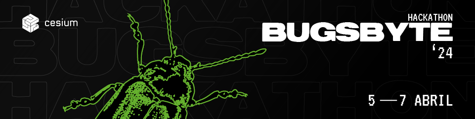

# 

## Commands

| Command                | Action                                            |
| :--------------------- | :------------------------------------------------ |
| `npm install`          | Install dependencies                              |
| `npm run dev`          | Start local dev server at `localhost:4321`        |
| `npm run build`        | Build your production site to `./dist/`           |
| `npm run preview`      | Preview your build locally, before deploying      |
| `npm run astro ...`    | Run CLI commands like `astro add`, `astro check`  |
| `npm run astro --help` | Get help using the Astro CLI                      |
| `npm run format`       | Format code with [Prettier](https://prettier.io/) |
| `npm run clean`        | Remove `node_modules` and build output            |

## 🤝 Contributing

When contributing to this repository, please first discuss the change you wish to make via issue, email, or any other method with the owners of this repository before making a change.

Please note we have a [code of conduct](CODE_OF_CONDUCT.md), please follow it in all your interactions with the project.

## 📝 License

Copyright (c) 2024, CeSIUM.

This project is licensed under the MIT License - see the [LICENSE](LICENSE)
file for details.
